# 魔法學院課程管理系統

# 專案簡介
此系統為魔法學院課程管理系統，採用 **Java Swing + MVC + SQL** 架構，支援學生選課、老師管理課程、成績登錄、報表統計等功能。  
# 功能特色

| 類別 | 功能特色 |
|------|----------|
| **Util** | - `CodeGenerator`：自動生成學生、老師、課程編號 <br> - `PasswordUtil`：密碼雜湊 SHA-256 / MD5，支援驗證 <br> - `DbConnection`：提供 MySQL 連線 |
| **DAO** | - 提供 CRUD 介面 <br> - `StudentDao`, `TeacherDao`, `CourseDao`, `EnrollmentDao` <br> - `dao.impl` 實作資料庫操作 |
| **Service** | - 商業邏輯處理 <br> - `StudentService`, `TeacherService`, `CourseService`, `EnrollmentService` <br> - `service.impl` 實作 Service 介面，封裝 DAO 操作 |
| **Controller** | - Swing 畫面控制 <br> - `LoginFrame`, `CoursePanel`, `TeacherPanel`, `ReportPanel` <br> - 處理按鈕事件、流程導向、報表呼叫 |
| **報表** | - `ReportPanel` 顯示課程學生數、通過率、平均分數、個人成績趨勢 <br> - 支援 Excel 匯出 |

---
# 專案架構

```text
MagicAcademy/
├─ src/main/java/
│  ├─ model/
│  │  ├─ Student.java
│  │  ├─ Teacher.java
│  │  ├─ Course.java
│  │  └─ Enrollment.java
│  ├─ dao/
│  │  ├─ StudentDao.java
│  │  ├─ TeacherDao.java
│  │  ├─ CourseDao.java
│  │  ├─ EnrollmentDao.java
│  │  └─ impl/
│  │     ├─ StudentDaoImpl.java
│  │     ├─ TeacherDaoImpl.java
│  │     ├─ CourseDaoImpl.java
│  │     └─ EnrollmentDaoImpl.java
│  ├─ service/
│  │  ├─ StudentService.java
│  │  ├─ TeacherService.java
│  │  ├─ CourseService.java
│  │  ├─ EnrollmentService.java
│  │  └─ impl/
│  │     ├─ StudentServiceImpl.java
│  │     ├─ TeacherServiceImpl.java
│  │     ├─ CourseServiceImpl.java
│  │     └─ EnrollmentServiceImpl.java
│  ├─ controller/
│  │  ├─ LoginFrame.java
│  │  ├─ MainMenuFrame.java
│  │  ├─ CoursePanel.java
│  │  ├─ TeacherPanel.java
│  │  └─ ReportPanel.java
│  └─ util/
│     ├─ CodeGenerator.java
│     ├─ PasswordUtil.java
│     └─ DbConnection.java
└─ pom.xml


---
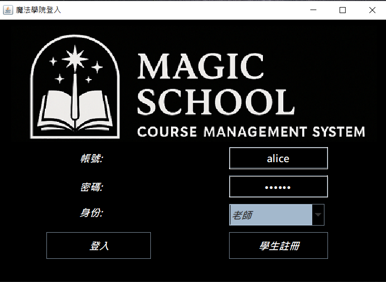  
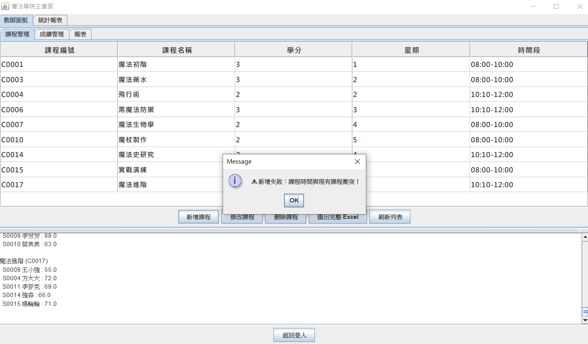  
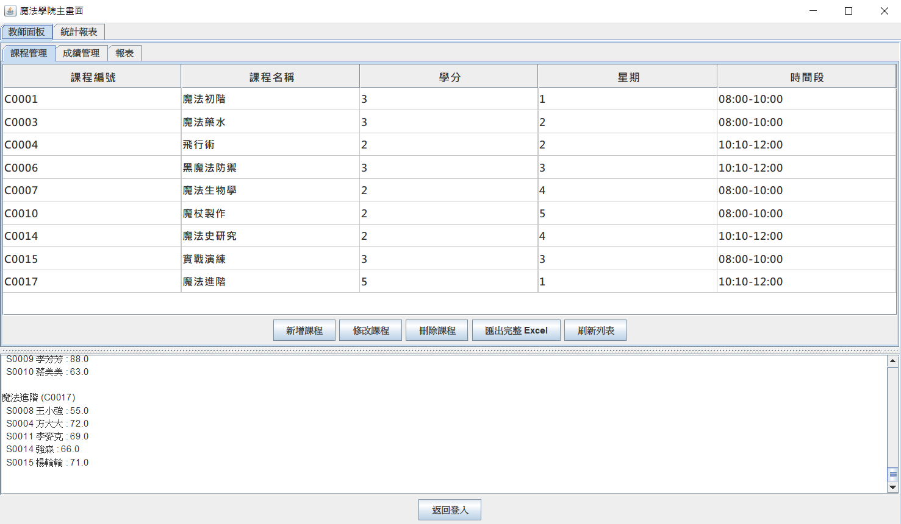  
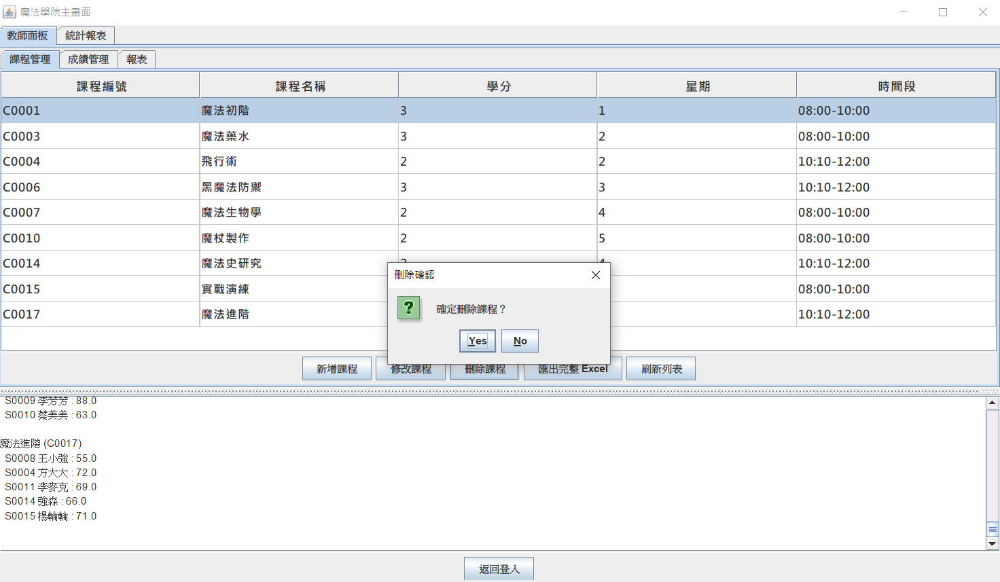  
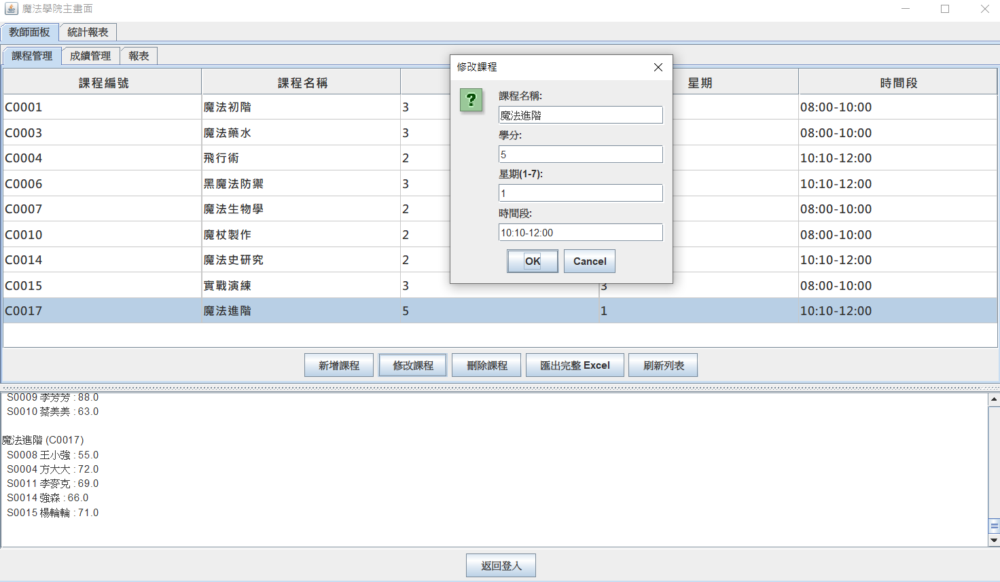  
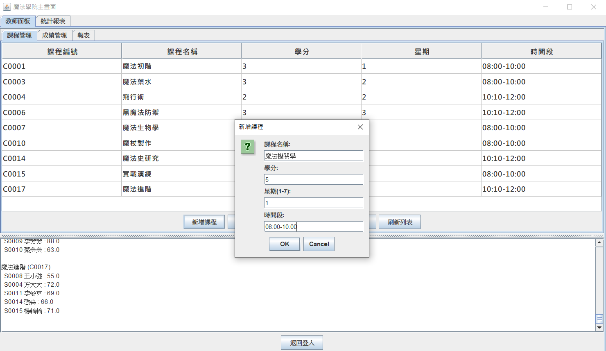  
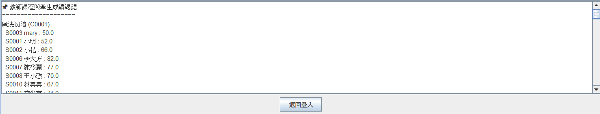 
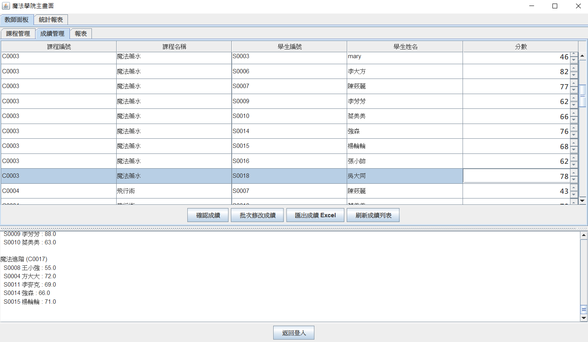  
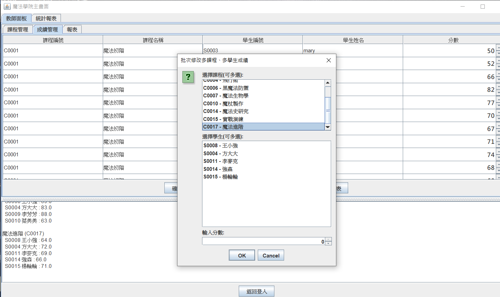  
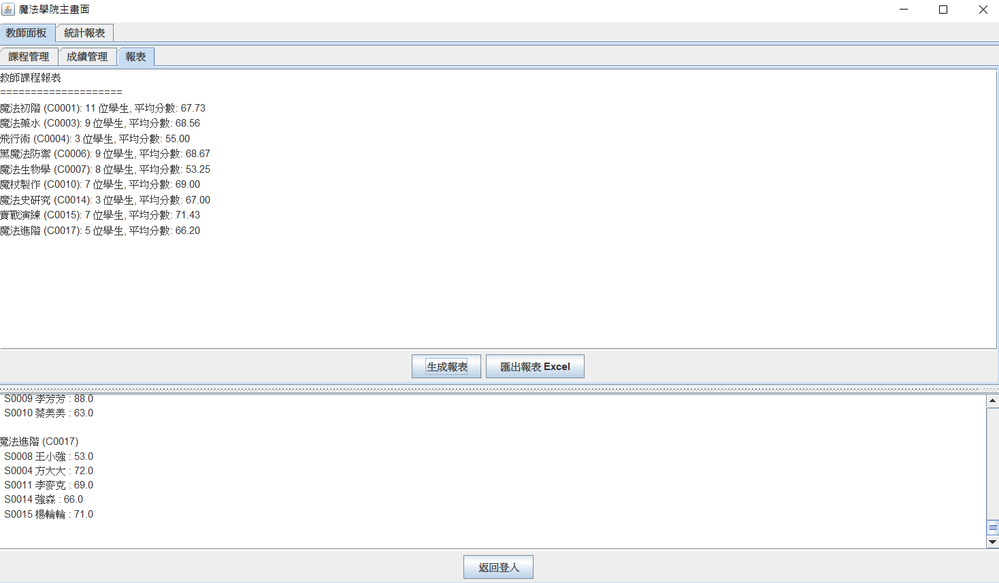  
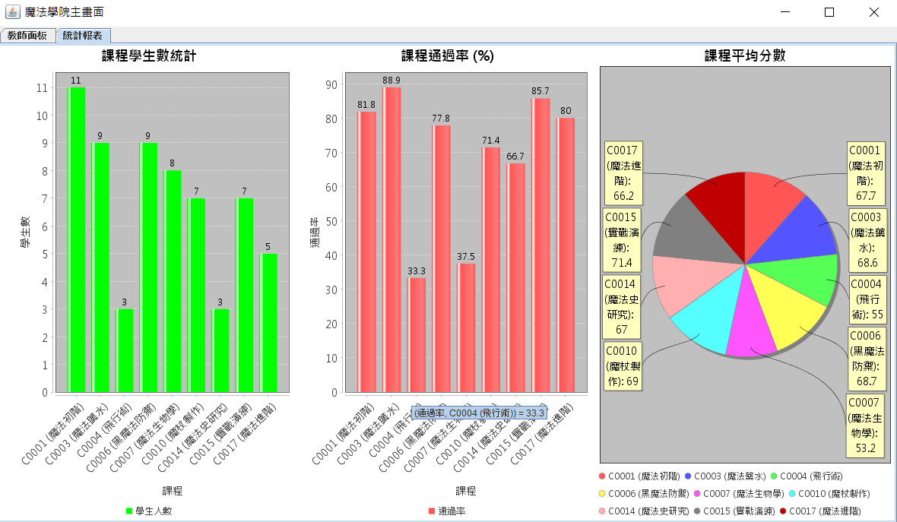

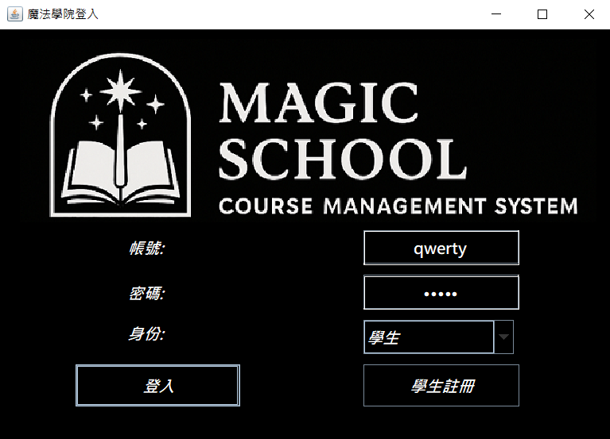
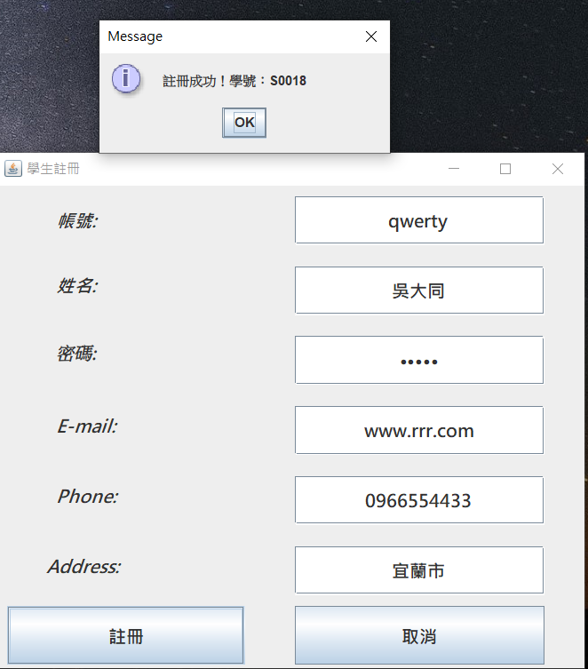
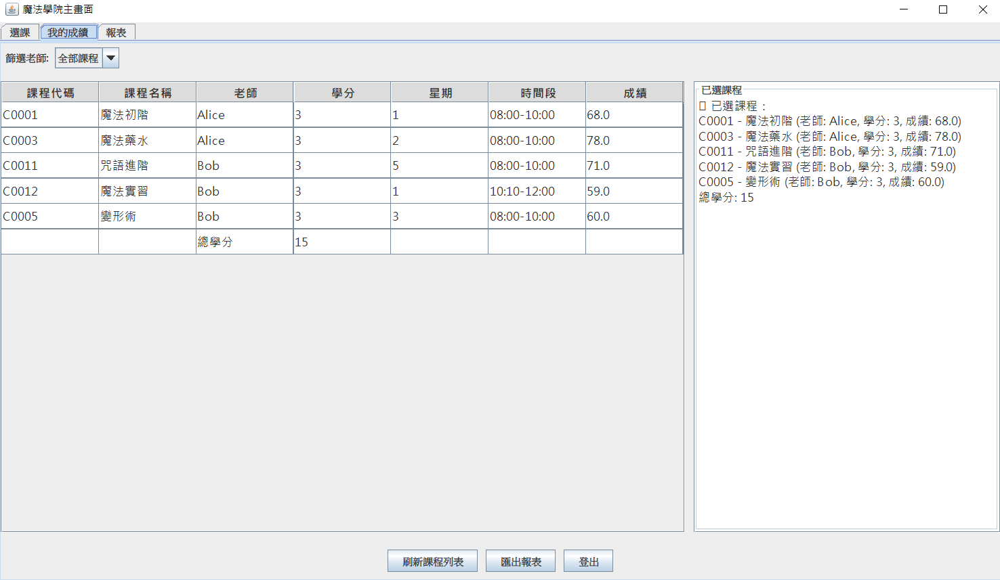  
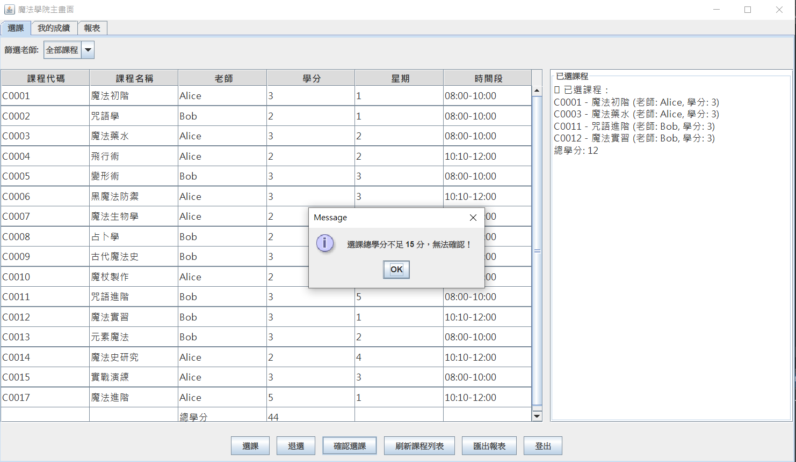  
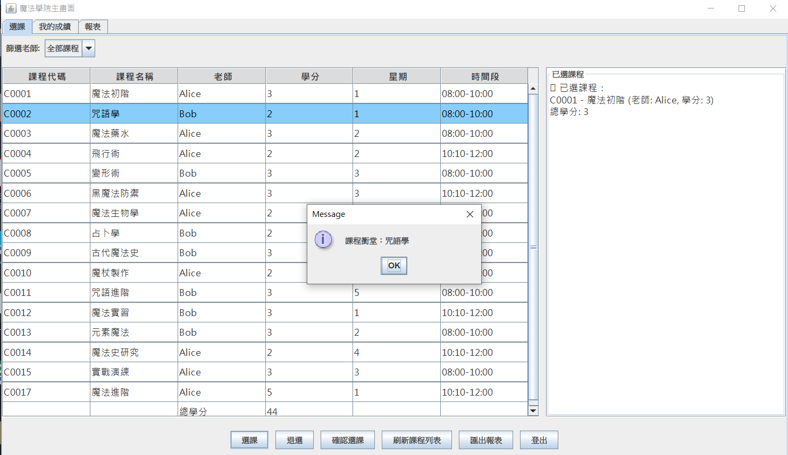  
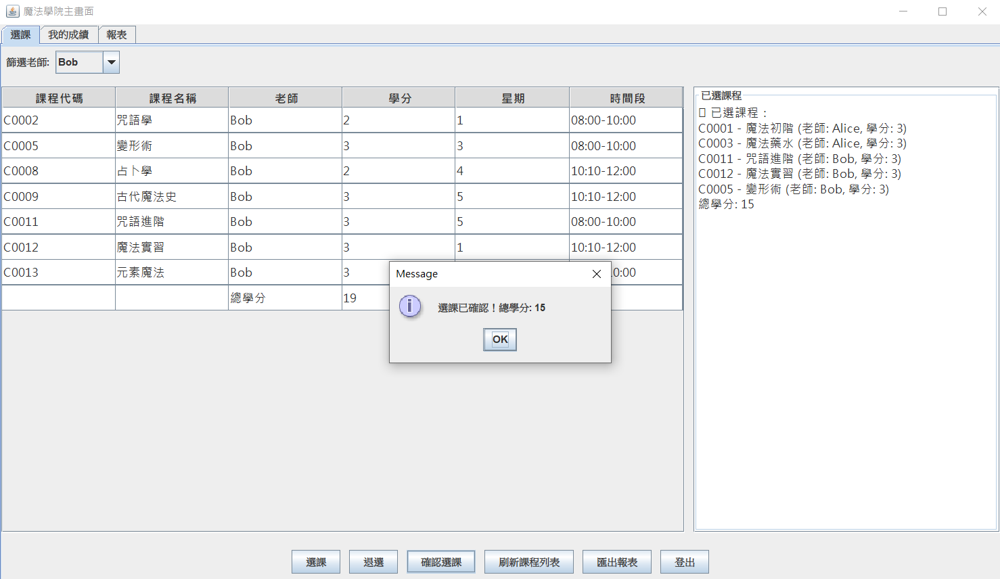  
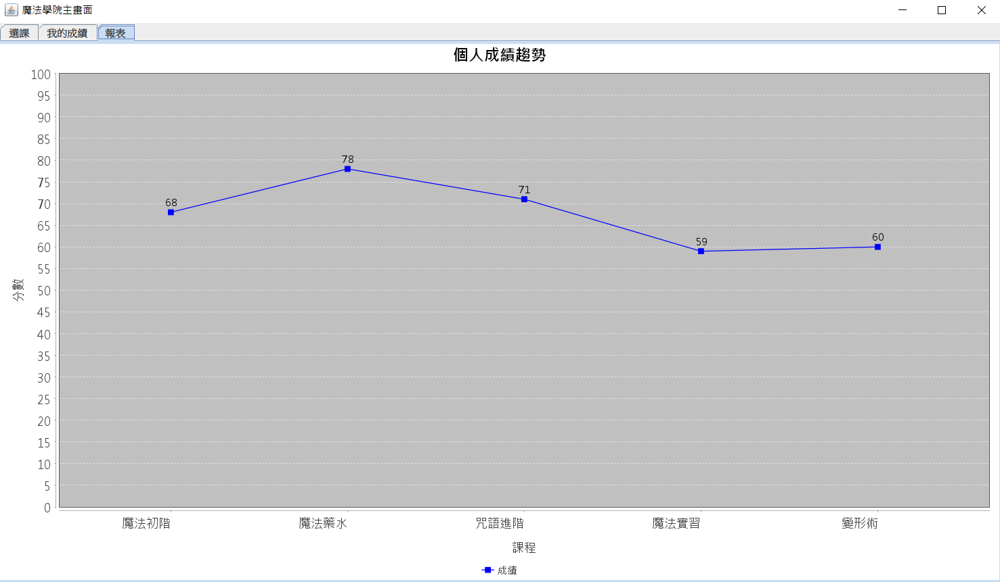

  


  


